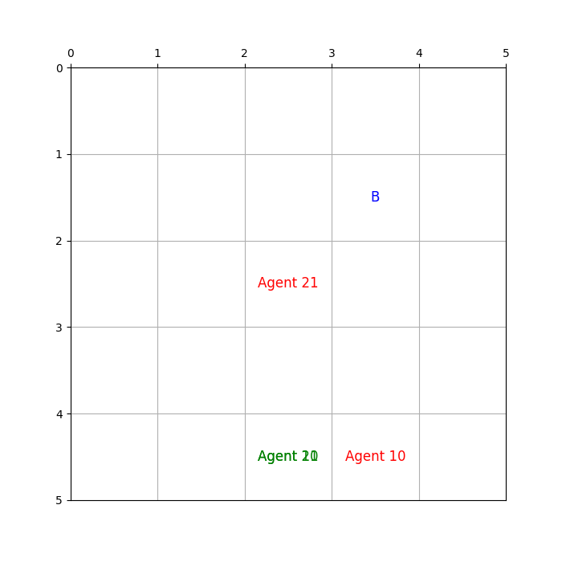
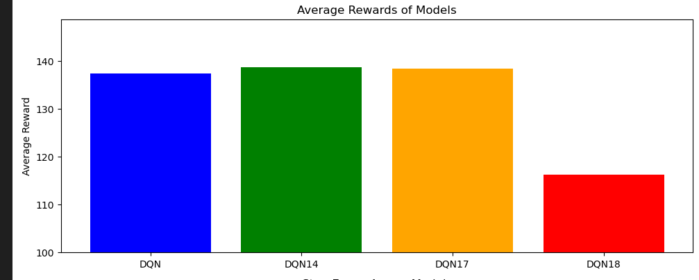
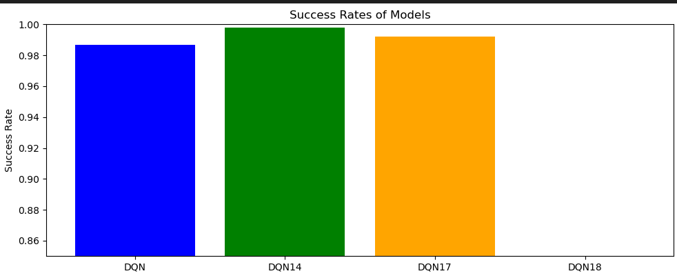
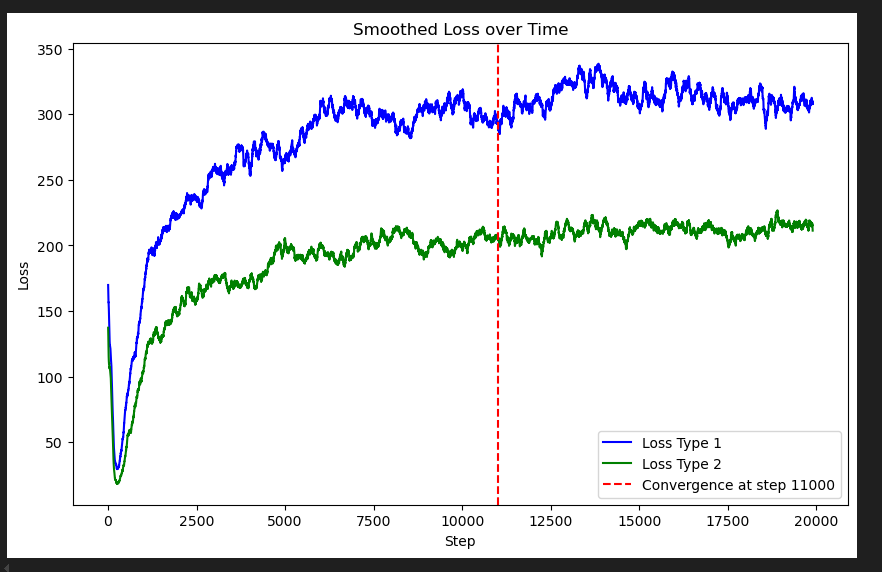

# Multi-Agent DQN

Implementation of a Multi-Agent Deep Q-Network for Cooperative Grid World.

## Demo

## Features

✔ PyTorch

✔ Experience Replay

✔ Target Network

✔ ε-greedy

✔ Multi-Agent

## Environment

5×5 Grid World

## Results(DQN14)

Average Reward(DQN14) 138.70

Average Rewards Acress Models

Success Rate(DQN14) 98.80%

Success Rate Across models

Loss Curve 

## Structure

...

## Run

download DQN14.pth, upload model and code to colab, and press run all!